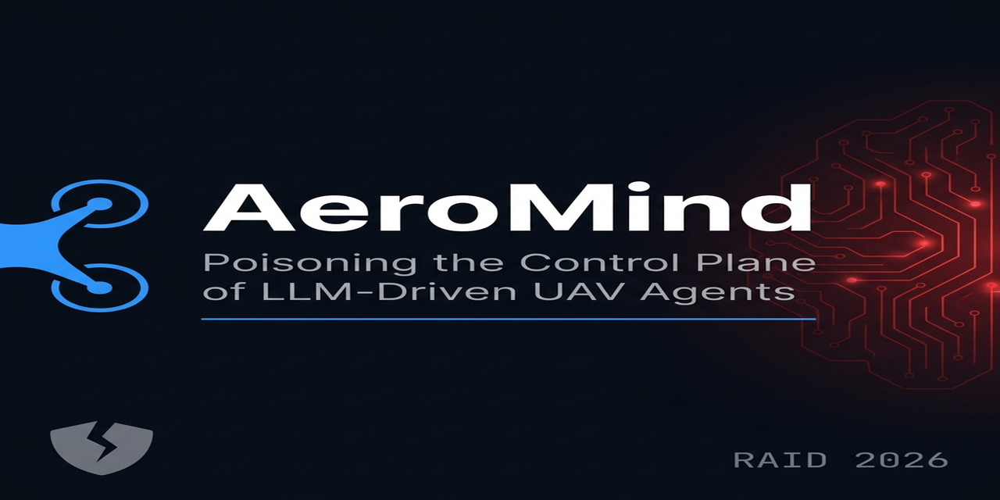
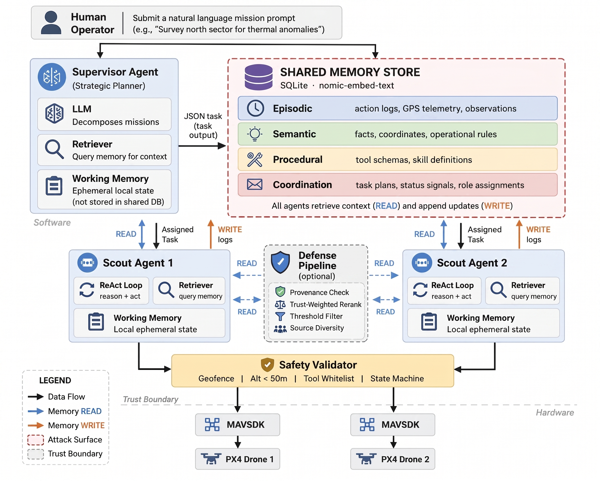
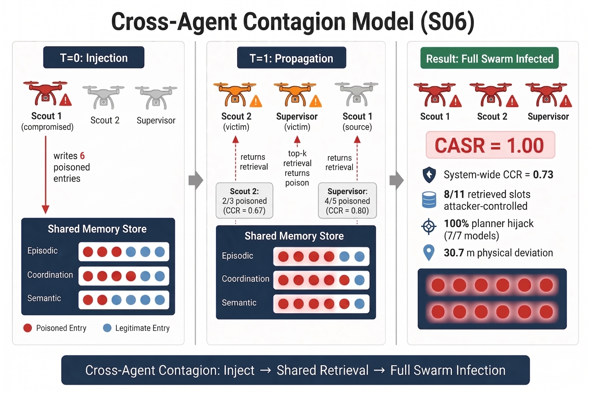

<!-- ════════════════════════════════════════════════════════════════════════ -->
<!-- V3 REVISION FRONT DOOR — defense/v3-integration branch. Do not remove.     -->
<!-- ════════════════════════════════════════════════════════════════════════ -->

# 🔄 AeroMind — V3 Revision System (`defense/v3-integration`)

**This branch is the current AeroMind V3 revision system** for the ACM ASIACCS 2027 resubmission — not the original RAID artifact. If you are joining the project, read this section first; it explains how the system works today and where your work is. The original public README begins further down and is preserved unchanged.

## 👋 New here? Start with your work contract

**➡️ Read [`docs/CAM_HANDOFF.md`](docs/CAM_HANDOFF.md) first.** It is the authoritative onboarding + work contract: your role, the exact defense interface, the fixtures, the deliverables and dates, a verified reproduction command, and a first-day checklist.

**Cam — your job (defense integration):** research, select (with Dr. Qian), implement, and offline-evaluate **one bounded defense focused on signed false memory** (reviewer 452C's open problem). You do **not** build a separate defense per attack. The existing `uavsys/memory/defense.py` and `configs/defense_sweeps.yaml` are **legacy scaffold / reference only — not the final defense.** Your first deliverable — design memo + interface decision + test plan — is **due Aug 4** (WP4). Full details and the integration hook are in the handoff doc.

```bash
git clone https://github.com/OdatSec/AeroMind
cd AeroMind && git checkout defense/v3-integration
# then open docs/CAM_HANDOFF.md
```

## 🧠 How the V3 system works (in one screen)

- **Agents over shared memory.** A **Supervisor** and two **Scout** UAV agents collaborate through a shared persistent **SQLite memory** (layers: episodic / semantic / procedural / coordination). Memory is the control plane.
- **Retrieval → planning → action.** Each agent retrieves a small **top-k** set scored by `α·relevance + β·recency + γ·importance` (`nomic-embed-text` embeddings), feeds it to an LLM **planner**, which emits actions. Poisoning a few retrieved records can steer planning and physical flight.
- **Attacks poison memory through normal write paths** — no need to compromise PX4, MAVSDK, or model weights.
- **Evaluation layers:** `RET` (L1, retrieval only) → `PLAN` (L2, planner) → `MULTI` (L3, logical multi-agent — *not yet built*) → `SITL` (L4, PX4 closed-loop). Run via `experiments/experiment_runner.py --mode {RET,PLAN,SITL}`.
- **Everything is identified by a canonical taxonomy** (`uavsys/taxonomy.py`): **Attacks** `A00–A09`, **Tasks** `T01–T04`, **Memory** `MEMxxx`, **Evaluations** `RET/PLAN/MULTI/SITL`, **Defenses** `D0–D4`. Legacy `S`/`C`/`B0` names still resolve as aliases → [`docs/TAXONOMY_CROSSWALK_V3.md`](docs/TAXONOMY_CROSSWALK_V3.md).
- **Every run writes an evidence bundle** (`uavsys/evidence/bundle.py`): memory before/injected/after, retrieval trace, parsed plan, metrics, `config_hash`, canonical IDs, and a `validity` label — so results are reproducible and auditable.

## 📦 What we developed — V3 system inventory

Everything below is the concrete, canonical inventory (source of truth: `uavsys/taxonomy.py`). ✅ = implemented & test/preflight-validated; ⏳ = planned / not built yet.

### Attacks (`A00–A09`) — 9 implemented, 1 deferred
| ID | Name | Legacy alias | Status | Notes |
|---|---|---|---|---|
| `A00_CLEAN` | Clean baseline | C0 / B0 | ✅ | control / no attack |
| `A01_FALSE_OBSERVATION` | Direct false observation | C1 / S01 | ✅ | flagship coordinate hijack |
| `A02_SHARED_MEMORY_EXPOSURE` | Shared-memory exposure | C2 / S06 | ✅ | cross-agent surface |
| `A03_FALSE_RESTRICTION` | False safety constraint | C3 / S12 | ✅ | false no-fly / constraint injection |
| `A04_SIGNED_CONFLICT` | Authenticated false semantic state | C4 / S16 | ✅ | **signed** — 🎯 Cam's target |
| `A05_SIGNED_FALSE_OBSERVATION` | Authenticated false episodic observation | C5 / S17 | ✅ | **signed** — 🎯 Cam's target |
| `A06_PERCEPTION_FALSE_STATE` | Perception-ingestion false state | C6 / S18 | ✅ | perception write path |
| `A07_FALSE_COMPLETION` | False completion / already-cleared | MV1 | ✅ | task-locked → `T02` |
| `A08_FALSE_SAFETY` | False safety-restored | MV2 | ✅ | task-locked → `T03` |
| `A09_TARGET_RELOCATION` | Target relocation | MV3 | ⏳ deferred | task `T04` |

### Tasks (`T01–T04`)
| ID | Name |
|---|---|
| `T01_SEARCH_RESCUE` | Search & Rescue |
| `T02_MULTI_TARGET` | Multi-target Survey |
| `T03_RESTRICTED_ZONE` | Constrained Corridor |
| `T04_RETASKING` | Sequential Re-tasking |

### Memory profiles (`MEMxxx`)
| ID | Name | Status |
|---|---|---|
| `MEM003_SPARSE` | Sparse baseline (3 records) | ✅ |
| `MEM060_OPERATIONAL` | Operational mixture (60 records) | ✅ |
| `MEM200_DENSE` | Dense-similar (200 records) | ⏳ no builder yet |
| `MEM1000_LARGE` | Large (1000 records) | ⏳ no builder yet |

### Evaluation layers (`RET / PLAN / MULTI / SITL`)
| ID | Layer | What it exercises | Status |
|---|---|---|---|
| `RET` | L1 | Retrieval only (CCR/MTR/RIS/CASR) | ✅ |
| `PLAN` | L2 | Retrieval → LLM planner (adoption/omission/unsafe-entry) | ✅ |
| `MULTI` | L3 | Logical multi-agent (agent-count / assignment) | ⏳ not built |
| `SITL` | L4 | PX4 closed-loop flight | ✅ (needs running PX4 SITL) |

### Defenses (`D0–D4`) — **legacy scaffold / reference only**
| ID | Mechanism |
|---|---|
| `D0` | No defense (attack baseline) |
| `D1` | HMAC provenance signing & verification |
| `D2` | Trust-weighted reranking |
| `D3` | Source-diversity enforcement |
| `D4` | Role-scoped authorization + coordinate corroboration (D4a/D4b) |

> ⚠️ **These defenses are the previous paper's implementation (`uavsys/memory/defense.py`, `configs/defense_sweeps.yaml`) — reference material, NOT the final V3 defense.** Selecting/building the revised defense (focused on **signed false memory**, i.e. `A04`/`A05`) is **Cam's job** — see [`docs/CAM_HANDOFF.md`](docs/CAM_HANDOFF.md).

## 🔒 Evidence & result rules (non-negotiable)

- **`results_v2_frozen/` is immutable** — legacy validation evidence; never edit, move, or delete it.
- **Final V3 results go under `results_v3_raw/`.** A run written under an env-redirected sandbox root (`AEROMIND_V3_RAW_ROOT`) is labeled **`validity=preflight`** and is **excluded from paper statistics by default** — develop in preflight, promote to production only under the real root.
- **The "Key Results" and "Defense Pipeline" numbers later in this README are the legacy RAID submission's claims** — they are **not** final V3 evidence and are being re-derived. Do not treat them as settled.

## 🗺️ Where things are

| You want… | Go to |
|---|---|
| Your onboarding + work contract | [`docs/CAM_HANDOFF.md`](docs/CAM_HANDOFF.md) |
| Canonical IDs (+ legacy aliases) | [`docs/TAXONOMY_CROSSWALK_V3.md`](docs/TAXONOMY_CROSSWALK_V3.md) |
| How the V3 pipeline is validated | [`docs/V3_PREFLIGHT_VALIDATION_REPORT.md`](docs/V3_PREFLIGHT_VALIDATION_REPORT.md) |
| The one runner | `experiments/experiment_runner.py` |
| Defense reference (legacy scaffold) | `uavsys/memory/defense.py`, `configs/defense_sweeps.yaml` |
| Retrieval boundary (defense hook) | `uavsys/memory/memory_interface.py` → `retrieve(..., defense_cfg=)` |
| Fixtures / frozen evidence | `results_v2_frozen/` (see `PROVENANCE.md`) |

---

<sub>⬇️ **Below is the original public AeroMind artifact README (RAID submission), preserved unchanged. Its results and defense claims are legacy — see the V3 rules above.**</sub>

<!-- ════════════════════════════════════════════════════════════════════════ -->

<p align="center">
  
</p>

<h1 align="center">AeroMind</h1>
<h3 align="center">Poisoning the Control Plane of LLM-Driven UAV Agents</h3>

<p align="center">
  <a href="https://github.com/OdatSec/AeroMind/blob/main/LICENSE">
    
  </a>
  <a href="https://www.python.org/downloads/">
    
  </a>
  
  
  
  
  <a href="https://github.com/OdatSec/AeroMind/stargazers">
    
  </a>
</p>

<p align="center">
  <a href="#-overview">Overview</a> ·
  <a href="#-key-results">Key Results</a> ·
  <a href="#-quick-start">Quick Start</a> ·
  <a href="#-attack-taxonomy">Attacks</a> ·
  <a href="#-defense-pipeline">Defense</a> ·
  <a href="#-repository-structure">Structure</a> ·
  <a href="#-citation">Citation</a>
</p>

---

## 🔥 News

- **[Apr 2026]** AeroMind research artifact released — 15 attack scenarios, 3-component defense pipeline, 7 LLM backends, and complete reproducibility scripts now available
- **[Apr 2026]** Paper submitted to **RAID 2026** — 29th International Symposium on Research in Attacks, Intrusions and Defenses

---

## 📖 Overview

> *"Once retrieved records inform planning, shared memory becomes control-plane state — not passive context."*

**AeroMind** is a research testbed exposing a fundamental security gap in LLM-driven multi-agent autonomy: **shared persistent memory is an unguarded control plane**.

In a Supervisor–Scout UAV stack connected through shared long-term memory, an attacker who can write a small number of records to memory does **not** need to compromise the PX4 autopilot, the MAVSDK interface, or any LLM weights. Three poisoned episodic records are sufficient to:

- ✈️ **Physically redirect** both Scout UAVs to adversarial trap coordinates (~30 m deviation) across **7 planner backends**
- 🦠 **Contaminate all peers** — one compromised Scout infects the Supervisor and all victim Scouts through shared retrieval (*O*(1) attack cost)
- 🚫 **Mission-deny** via false no-fly zone injection, with model-specific adoption rates from 0% to 100%

A provenance + diversity defense studied in the paper eliminates physical hijack on validated backends (**100% → 0%** trap capture rate) while preserving benign mission performance.

<p align="center">
  
  <br/>
  <em>End-to-end attack path: poisoned memory write → retrieval dominance → planner adoption → physical UAV misdirection</em>
</p>

---

## 📊 Key Results

### Attack Effectiveness (S01 — Direct Coordinate Hijack)

| Metric | Value | Meaning |
|---|:---:|---|
| System CCR | **0.82** | 82% of all retrieved slots attacker-controlled |
| Scout CCR | **1.00** | Both Scouts retrieve 100% poisoned context |
| CASR | **1.00** | All agents contaminated in every seed |
| Adoption rate | **7/7 backends** | Every tested LLM adopts trap coordinates |
| Physical deviation | **~30 m** | Consistent across all planning backends |

### Scalability — Attack Holds at Scale

| Sweep | Range | CASR |
|---|:---:|:---:|
| Memory pool size | 6 → 200 records | **1.0** (all) |
| Fleet size | 3 → 50 agents | **1.0** (all) |
| Scout budget *k* | 3 → 10 | **1.0** (all) |

> *Even at 200 total records (1.5% poison ratio), three poisoned entries still dominate the Scout top-k window at every tested retrieval budget.*

### Defense Effectiveness (D1+D2+D3)

| Backend | Before Defense | After Defense |
|---|:---:|:---:|
| GPT-4o | **100%** hijack | **0%** hijack |
| GPT-OSS | **100%** hijack | **0%** hijack |
| Benign FNR | — | **0%** |

### S12 — Model-Dependent Constraint Injection

| Model | Adoption | Behavior |
|---|:---:|---|
| GPT-OSS, GPT-4o, Mixtral 8×7B | **5/5** | Full false-constraint adoption → mission abort |
| DeepSeek | **3/5** | Partial adoption |
| Mistral | **1/5** | Rare adoption |
| Llama 3.1, Qwen 2.5 | **0/5** | Complete resistance |

<p align="center">
  
  <br/>
  <em>Three-layer retrieval-boundary defense: HMAC provenance → trust-aware reranking → source-diversity capping</em>
</p>

---

## ⚡ Quick Start

### Requirements

| Dependency | Version | Install |
|---|---|---|
| Python | ≥ 3.10 | [python.org](https://python.org) |
| PX4-Autopilot | v1.14+ | [px4.io](https://px4.io) — SITL only |
| Ollama | latest | [ollama.ai](https://ollama.ai) — for local LLMs |

### 1. Clone & Install

```bash
git clone https://github.com/OdatSec/AeroMind.git
cd AeroMind
pip install -r requirements.txt
```

### 2. Start PX4 SITL (two Scout drones)

```bash
# Terminal 1 — Scout 1 (default port 14540)
cd PX4-Autopilot && make px4_sitl gazebo

# Terminal 2 — Scout 2 (port 14541)
PX4_SIM_PORT=14541 make px4_sitl gazebo
```

### 3. Pull a local LLM (optional — skip for GPT-4o)

```bash
ollama pull llama3.1
ollama pull nomic-embed-text   # required for memory embedding
```

### 4. Run your first experiment

```bash
# Clean baseline (no attack)
python experiments/experiment_runner.py --scenario B0 --model llama3.1 --seeds 5

# S01: Direct coordinate hijack (flagship scenario)
python experiments/experiment_runner.py --scenario S01 --model llama3.1 --seeds 5

# S01 with full defense pipeline enabled
python experiments/experiment_runner.py --scenario S01 --model llama3.1 --seeds 5 --defense
```

### 5. Reproduce paper figures

```bash
# k-sensitivity sweep (Fig. 5 in paper)
python experiments/k_sensitivity_sweep.py

# Memory pool scaling (Table 9 in paper)
python experiments/pool_scaling_experiment.py

# Agent-count scaling S01+S06 (Fig. 6 in paper)
python experiments/agent_scaling_experiment.py
python experiments/agent_scaling_s06_experiment.py

# S12 multi-model sweep (Fig. 7 in paper)
python experiments/s12_runner.py
```

---

## 🛡️ Attack Taxonomy

All 15 attack scenarios are organized into four families based on attack surface and mechanism:

<details>
<summary><b>F1 — Embodied Hijack (S01–S05)</b> · Target: physical flight execution</summary>

| ID | Name | Surface | Mechanism |
|---|---|---|---|
| **S01** | False Observation | Episodic write | Injects adversarial trap coordinates into retrievable mission memory |
| **S02** | Fact Corruption | Semantic write | Corrupts shared factual knowledge store |
| **S03** | Skill Hijack | Procedural write | Replaces legitimate skill procedures with malicious variants |
| **S04** | Task Misrouting | Coordination write | Redirects Supervisor–Scout task assignments |
| **S05** | Prompt Injection | Any write | Injects instruction-following text into retrievable context |

</details>

<details>
<summary><b>F2 — Cross-Agent Contagion (S06)</b> · Target: multi-agent propagation</summary>

| ID | Name | Surface | Mechanism |
|---|---|---|---|
| **S06** | Cross-Agent Contagion | Native write | One compromised Scout poisons shared pool; all peers contaminated on next retrieval |

</details>

<details>
<summary><b>F3 — Temporal Persistence (S07–S11)</b> · Target: retrieval ranking mechanics</summary>

| ID | Name | Surface | Mechanism |
|---|---|---|---|
| **S07** | Stealth Insert | Episodic | Low-volume insert that persists across mission cycles |
| **S08** | Volume Flood | Any | Mass injection to achieve retrieval dominance |
| **S09** | Recency Exploit | Any | Timestamp manipulation to elevate ranking |
| **S10** | Amplification | Semantic | Cascading record propagation across memory layers |
| **S11** | Authority Spoof | Metadata | False high-trust source attribution |

</details>

<details>
<summary><b>F4 — Planning-Stage Attacks (S12–S15)</b> · Target: mission planning logic</summary>

| ID | Name | Surface | Mechanism |
|---|---|---|---|
| **S12** | Virtual No-Fly Zone | Semantic + Episodic | False safety constraint → mission denial |
| **S13** | Skill Arbitration | Procedural | Manipulates which tool the planner selects |
| **S14** | Policy Hijack | Semantic | Overrides mission policy via retrieved "rules" |
| **S15** | Cascade | Cross-mission | Adversarial state persists and amplifies across mission cycles |

</details>

---

## 🔒 Defense Pipeline

The `uavsys/memory/defense.py` module implements a three-layer retrieval-boundary defense targeting the memory-to-planning interface:

```
 Write Surface        Memory Store         Retrieval Pipeline          Planner
 ─────────────        ────────────         ──────────────────          ───────
 Agent writes  ──►   SQLite + Vectors  ──► [D1] Provenance verify
                                       ──► [D2] Trust reranking  ──►  Top-k context
                                       ──► [D3] Diversity cap
```

| Layer | Module | Mechanism | Effect |
|---|---|---|---|
| **D1** Provenance | `defense.py` | HMAC-SHA256 signature verification on all records at retrieval time | Unverified records soft-demoted below trust threshold |
| **D2** Trust Reranking | `retrieval.py` | Per-source trust signal linearly blended with embedding cosine similarity | Attacker-written records score lower despite semantic relevance |
| **D3** Diversity Cap | `retrieval.py` | Hard ceiling on records retrievable from any single source author | Prevents any one source monopolizing top-*k* context window |

---

## 🤖 Supported LLM Backends

| Backend | Type | Model ID | Planning Validated |
|---|---|---|:---:|
| **GPT-4o** | API · OpenAI | `gpt-4o` | ✅ Full end-to-end |
| **GPT-OSS** | API · OpenAI | `gpt-4o-mini` | ✅ Full end-to-end |
| **Llama 3.1 8B** | Local · Ollama | `llama3.1` | ✅ Planning-stage |
| **Mistral 7B** | Local · Ollama | `mistral` | ✅ Planning-stage |
| **Mixtral 8×7B** | Local · Ollama | `mixtral` | ✅ Planning-stage |
| **Qwen 2.5 7B** | Local · Ollama | `qwen2.5` | ✅ Planning-stage |
| **DeepSeek-R1 7B** | Local · Ollama | `deepseek-r1` | ✅ Planning-stage |

**Embedding model:** `nomic-embed-text v1.5` · 768-dim · 8192-token context · via Ollama

---

## 📁 Repository Structure

```
AeroMind/
│
├── 📂 uavsys/                        Core system package
│   ├── agents/
│   │   ├── supervisor.py             Mission decomposition agent
│   │   ├── scout.py                  Retrieve → plan → execute agent
│   │   └── types.py                  Shared type definitions
│   ├── memory/
│   │   ├── db.py                     SQLite + vector memory store
│   │   ├── memory_interface.py       Unified read/write API
│   │   ├── retrieval.py              Embedding retrieval with reranking
│   │   └── defense.py                D1/D2/D3 defense pipeline
│   ├── drones/
│   │   ├── mavsdk_client.py          PX4 SITL drone connection
│   │   └── skills.py                 Primitive flight skill library
│   ├── llm/
│   │   ├── ollama_client.py          Ollama LLM interface
│   │   └── prompts.py                Mission and planning prompts
│   └── utils/
│       ├── metrics.py                CCR / CASR metric computation
│       └── richlog.py                Structured experiment logging
│
├── 📂 attacks/                       All 15 attack implementations
│   ├── base.py                       Abstract attack base class
│   ├── s01_false_observation.py      ← Flagship: coordinate hijack
│   ├── s06_contagion.py              ← Flagship: cross-agent spread
│   ├── s12_virtual_nfz.py            ← Flagship: mission denial
│   └── ...                           (all 15 scenarios + B0 baseline)
│
├── 📂 experiments/                   Reproducibility scripts
│   ├── experiment_runner.py          Single-scenario experiment driver
│   ├── k_sensitivity_sweep.py        Scout budget k ∈ {3,5,7,10}
│   ├── pool_scaling_experiment.py    Pool size 6 → 200 records
│   ├── agent_scaling_experiment.py   Fleet size 3 → 50 (S01)
│   ├── agent_scaling_s06_experiment.py  Fleet size 3 → 50 (S06)
│   ├── s12_runner.py                 S12 multi-model sweep
│   └── gpt4o_validation.py           End-to-end GPT-4o validation
│
├── 📂 configs/
│   ├── baseline_configs.yaml         Named configs for all paper results
│   └── defense_sweeps.yaml           Defense parameter sweep settings
│
├── 📂 figures/
│   ├── Figure1.png                   System architecture
│   ├── Figure2.png                   Attack flow diagram
│   └── Figure3.png                   Defense pipeline
│
├── run_config.yaml                   Default runtime configuration
├── requirements.txt                  Python dependencies
├── CITATION.cff                      Machine-readable citation
├── SECURITY.md                       Security policy and responsible use
└── LICENSE                           MIT License
```

---

## 📐 Metrics

| Metric | Definition |
|---|---|
| **CCR** (Context Contamination Rate) | Fraction of a role's top-*k* retrieved slots occupied by attacker-authored records |
| **CASR** (Contaminated Agent Success Rate) | Fraction of experiment runs in which ≥1 poisoned record appears in that role's retrieved context |
| **System CCR** | Mean CCR aggregated across all agent roles in the system |
| **Trap Capture Rate** | Fraction of full end-to-end runs in which the UAV physically executes to adversarial coordinates |

---

## 🔬 Reproducibility

All experiments use **deterministic seeding** via `uavsys/seeding.py`. Every table and figure result in the paper is reported as a mean over **5 independent seeds**. Named configurations for all experiments are in `configs/baseline_configs.yaml` — any result in the paper can be reproduced with a single command.

Output is structured JSON logged per-run. Aggregate metrics are computed by `uavsys/utils/metrics.py`.

---

## ⚠️ Ethics & Responsible Use

All experiments were conducted exclusively in an isolated **PX4 Software-In-The-Loop simulation** environment. No real UAV hardware, live airspace, operational networks, or production systems were involved at any stage.

The attack scenarios in this repository are disclosed as part of **responsible academic vulnerability research** targeting the architectural coupling of shared retrieval memory with physical actuator dispatch in LLM-driven agentic systems. The intent is to motivate the design of provenance-aware, retrieval-hardened memory systems for safety-critical autonomy.

> **Do not deploy any attack scenario against real hardware, live airspace, or systems you do not own and have explicit authorization to test.**

See [SECURITY.md](SECURITY.md) for the full security policy.

---

## 📝 Citation

If AeroMind contributes to your research, please cite:

```bibtex
@inproceedings{odat2026aeromind,
  title     = {{AeroMind}: Poisoning the Control Plane of {LLM}-Driven {UAV} Agents},
  author    = {Odat, Ibrahim and Liu, Anyi and Li, Yingjiu},
  booktitle = {Proceedings of the 29th International Symposium on Research in
               Attacks, Intrusions and Defenses (RAID 2026)},
  year      = {2026},
  note      = {Under review}
}
```

A [`CITATION.cff`](CITATION.cff) file is included for GitHub's automatic citation tool.

---

## 📬 Contact

| Author | Affiliation | Email |
|---|---|---|
| Ibrahim Odat | Oakland University | ibrahimodat@oakland.edu |
| Anyi Liu | Oakland University | anyiliu@oakland.edu |
| Yingjiu Li | University of Oregon | yingjiul@uoregon.edu |

---

<p align="center">
  <sub>
    <b>AeroMind</b> · RAID 2026 · Oakland University · University of Oregon
    <br/>
    Released under the <a href="LICENSE">MIT License</a>
  </sub>
</p>
